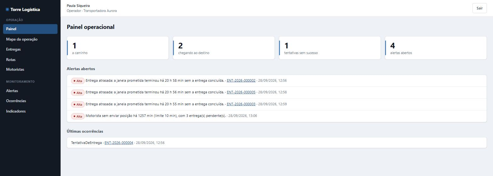
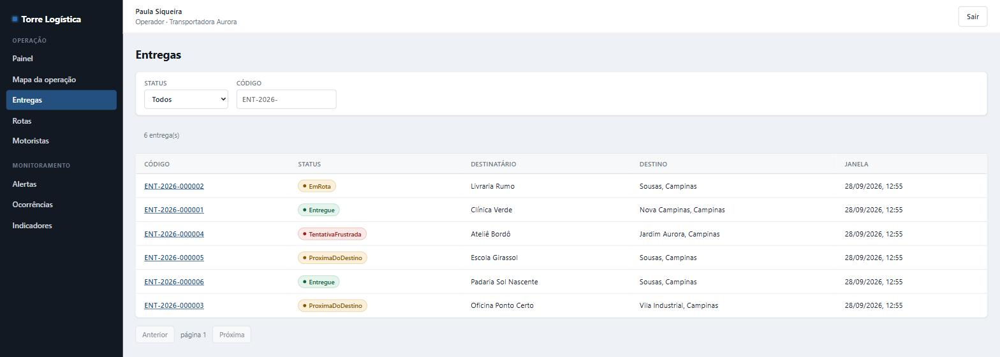
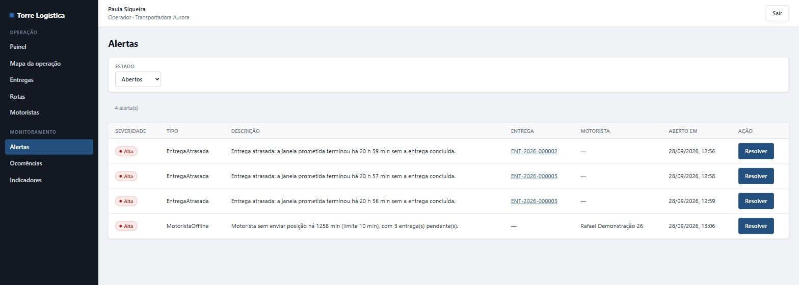
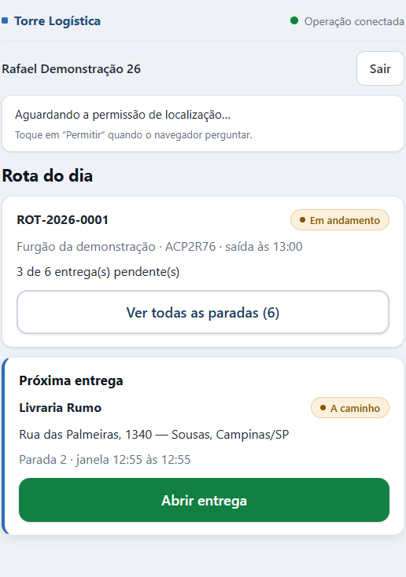
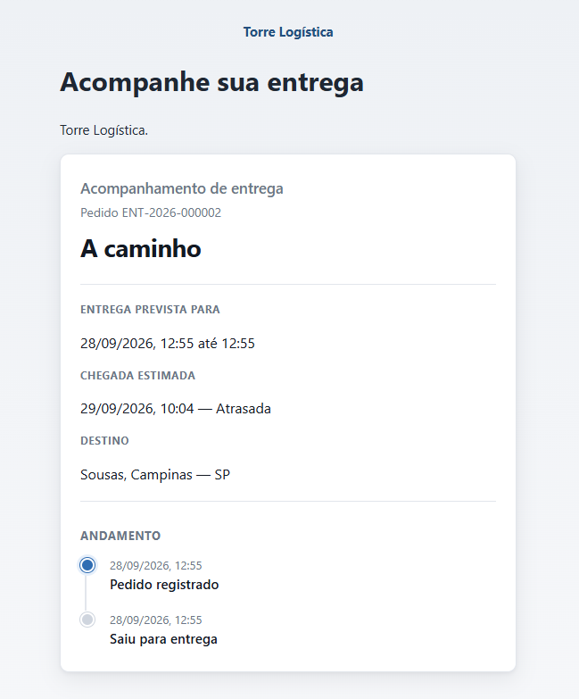

# Torre Logística

Plataforma B2B de operação logística em tempo real: acompanhamento de entregas entre a
saída para rota e a conclusão, com localização, ETA, SLA, geofencing, alertas,
ocorrências, prova de entrega e rastreamento público controlado.

> **v1.0.0 — no ar.** Demonstração pública, sem cadastro, por US$ 0,00/mês:
> **[operacao.torre.lucasafvr.com.br](https://operacao.torre.lucasafvr.com.br)** → *Explorar demonstração*.

## O problema

Uma transportadora com frota própria ou operação de última milha perde a entrega de vista no
momento em que o veículo sai para a rua. Onde está o motorista, vai atrasar, o cliente foi avisado,
a tentativa falhou por quê, cadê a foto da entrega — tudo isso vive em telefonemas, planilhas e
grupos de mensagem. A Torre Logística fecha essa lacuna entre a **saída para rota** e a
**conclusão**, com o dado chegando do próprio aparelho do motorista.

## O produto

Três experiências sobre o mesmo núcleo operacional:

| Para quem | Aplicação | O que faz |
|---|---|---|
| Administrador, Supervisor, Operador | **Console** | mapa da operação, entregas, SLA/ETA, alertas, ocorrências, indicadores, auditoria |
| Motorista | **PWA** | rota do dia, chegada, conclusão, ocorrência e comprovante — funcionando **offline** |
| Destinatário | **Rastreamento público** | link com token forte, região aproximada do veículo, sem dados sensíveis |

Não é SaaS comercial ativo, é projeto de portfólio — mas arquitetado para virar um sem reescrita.

## O público

Empresas de entrega local ou regional com frota própria: transportadoras, operações de última
milha, distribuidoras. Quem hoje acompanha entrega por telefone e planilha.

## O fluxo

```text
Entrega criada → planejada → atribuída ao motorista → saída para rota
  → localização em tempo real → ETA → acompanhamento de SLA
  → alertas e ocorrências → chegada (geofence) → prova de entrega → concluída → histórico
```

Fluxos alternativos: tentativa frustrada → reagendamento, ou cancelamento a partir de estado
autorizado. A máquina de estados recusa regressão — entrega concluída não volta para *em rota* por
telemetria atrasada.

---

> **Capacidades entregues, fase a fase.**
> Login em canais separados, isolamento entre organizações, cadastros, entrega com timeline
> somente-inserção, rota do dia, execução por máquina de estados, telemetria GPS, geofence do destino
> no PostGIS, tempo real do console, previsão de chegada com SLA explicável, motor de alertas, a PWA do
> motorista e, agora, a **operação sem conexão**: toda ação do motorista nasce no aparelho com
> identificador próprio, fica guardada sem internet e é aplicada exatamente uma vez quando a conexão volta —
> resposta perdida não duplica, e cancelamento feito enquanto o motorista estava offline não é
> sobrescrito. Agora também as **ocorrências da última milha**: motivo tipado para cada falha, ocorrência
> somente-inserção com severidade, hora, lugar e autor, e alerta crítico na torre quando a mercadoria ou a
> segurança entram no caminho. Agora também a **prova de entrega**: quem recebeu, quando, onde e a foto —
> com o arquivo fora do banco, subindo direto ao storage por URL assinada de curta duração e saindo de lá do
> mesmo jeito, nunca por link público. E agora o **rastreamento público**: o destinatário acompanha a
> encomenda por um link com token forte — do qual o banco guarda só o hash —, vendo a região aproximada do
> veículo em vez da rua, e nunca o motorista, a rota ou o endereço completo. E agora os **indicadores
> operacionais**: pontualidade, sucesso na primeira tentativa, atraso médio, tempo por parada e tempo em
> rota, com os recortes por motorista, cliente, rota e motivo — cada número acompanhado da pergunta que
> responde e da definição de como foi calculado, e vazio quando não há base, porque "0%" e "não houve
> entrega" são fatos opostos. E agora o **prazo de validade do rastro**: a localização bruta deixa de ser
> guardada para sempre — prazo configurável, corte pelo instante em que o servidor recebeu (não pelo
> relógio do aparelho), limpeza em lotes que não segura o banco, e a posição atual preservada, porque
> apagar o caminho percorrido não pode cegar a torre. O modelo de segurança inteiro, com o que ainda **não**
> está coberto, está em [`docs/security-model.md`](./docs/security-model.md). E agora o sistema **se
> explica**: o rastro nasce na requisição, é gravado junto com o fato, atravessa a fila do outbox e
> reaparece no webhook que falhou — quem tem o identificador que o cliente recebeu descobre o que
> aconteceu sem abrir o banco. E agora o sistema tem **números**: a ingestão sustenta as 33 posições por
> segundo da meta, o volume de um dia inteiro não a degrada — o que custa é a concorrência —, e o
> particionamento foi **recusado** porque a medição não o justificou. Os números, o ambiente e os gargalos
> conhecidos estão em [`docs/performance.md`](./docs/performance.md). E agora a operação **acontece
> sozinha**: o simulador encena seis histórias contra a API real — entrega no prazo, risco de atraso,
> motorista que some do mapa, porta fechada, chegada detectada pelo geofence e prova de entrega — sem
> tocar no banco, e a mesma semente conta a mesma história. O guia está em
> [`docs/operacao/simulador.md`](./docs/operacao/simulador.md). E agora existe **porta de entrada**: quem
> chega sem credencial clica em *Explorar demonstração* e cai numa operação acontecendo — o servidor faz o
> login pelo visitante, com conta de privilégio mínimo, e a porta simplesmente não existe num ambiente
> comercial. A infraestrutura está **escrita e não aplicada**: a comparação que a escolheu está em
> [`docs/cost-model.md`](./docs/cost-model.md), e a decisão que a decidiu é que este sistema **trabalha
> quando ninguém olha** — avalia SLA, despacha webhook e apaga rastro vencido de madrugada —, então
> escala a zero não serve — e, pelo mesmo motivo, os laços de fundo saíram da API para um **processo de
> workers próprio**, sem porta nenhuma publicada. A ordem está em [`ROADMAP.md`](./ROADMAP.md).
>
> E agora o sistema **está no ar**. Depois de a capacidade Ampere A1 não aparecer em 143 consultas ao
> longo de 12 horas, a demonstração foi para uma VM `E2.1.Micro` Always Free na Oracle Cloud, também
> por US$ 0,00 — a pilha inteira, com PostgreSQL/PostGIS, Workers, SignalR e HTTPS, cabendo em 1 GB
> de RAM sem remover funcionalidade. Foi validada **na infraestrutura pública real**, não em
> localhost, e passou por um pentest gray-box de 16 categorias sem vulnerabilidade de alta
> severidade em aberto ([`docs/pentest-v1.md`](./docs/pentest-v1.md)). A arquitetura de produção no
> Azure segue intacta ao lado, como o alvo recomendado para cliente real.

## Stack

| Camada | Tecnologia |
|---|---|
| Backend | C# / .NET 10, ASP.NET Core |
| Banco | PostgreSQL 17 + PostGIS (3.5 no dev, 3.6 na demo pública), EF Core 10 |
| Frontend | React 19, TypeScript estrito, Vite 8, React Router, TanStack Query, Zod |
| Tempo real | SignalR (canal do console) |
| Testes | xunit.v3, Testcontainers, Vitest, Testing Library |
| Observabilidade | Serilog estruturado; OpenTelemetry (traces e métricas) por OTLP |

## Estrutura

```text
src/
  TorreLogistica.Domain/          regras e invariantes — sem infraestrutura
  TorreLogistica.Application/     casos de uso
  TorreLogistica.Infrastructure/  PostgreSQL/PostGIS, relógio, identificador
  TorreLogistica.Api/             borda HTTP
  TorreLogistica.Workers/         carga assíncrona
  TorreLogistica.Simulator/       cliente externo, sem acesso ao núcleo

apps/
  operacao/        console operacional   :5173
  motorista/       PWA do motorista      :5174
  rastreamento/    rastreamento público  :5175

tests/
  TorreLogistica.UnitTests/
  TorreLogistica.IntegrationTests/    PostGIS real via Testcontainers
  TorreLogistica.ArchitectureTests/

docs/
  adr/             decisões de arquitetura
  arquitetura/
  operacao/        ambiente local, armadilhas da máquina
  seguranca/       gestão de segredos
```

## Como executar

Pré-requisitos: .NET SDK 10.0.400, Node ≥ 22.22, Docker com contêineres Linux.

```bash
cp .env.example .env        # e troque TORRE_POSTGRES_SENHA
docker compose up -d        # PostgreSQL + PostGIS na porta 55432
npm install

dotnet dotnet-ef database update \
  --project src/TorreLogistica.Infrastructure \
  --startup-project src/TorreLogistica.Infrastructure

dotnet run --project src/TorreLogistica.Api   # http://localhost:5080
npm run dev:operacao                          # http://localhost:5173
```

O passo a passo completo, incluindo três armadilhas reais desta máquina de
desenvolvimento, está em
[`docs/operacao/ambiente-local.md`](./docs/operacao/ambiente-local.md).

## Testes

```bash
powershell -ExecutionPolicy Bypass -File scripts/testar.ps1   # backend
npm run verificar                                             # frontend
```

| Suíte | Provas |
|---|:---:|
| Unidade | 695 |
| Arquitetura | 22 |
| Integração (PostgreSQL + PostGIS real) | 544 |
| Frontend (3 aplicações) | 131 |

Integração usa PostgreSQL com PostGIS de verdade, por Testcontainers. Provedor em
memória não prova transação, constraint, índice nem geografia — que é justamente o que
este projeto precisa demonstrar.

`dotnet test` não é usado: no SDK 10.0.400 com xunit.v3 4.0.0 ele encerra com "Zero
testes executados" enquanto o executável de teste roda tudo. O motivo está documentado
em [`docs/operacao/ambiente-local.md`](./docs/operacao/ambiente-local.md#por-que-não-dotnet-test).

## Decisões de arquitetura

| ADR | Decisão |
|---|---|
| [0001](./docs/adr/0001-monolito-modular.md) | Monólito modular com workers separados |
| [0002](./docs/adr/0002-postgresql-postgis.md) | PostgreSQL com PostGIS como banco principal |
| [0003](./docs/adr/0003-tres-aplicacoes-web.md) | Três aplicações web separadas |
| [0004](./docs/adr/0004-uuidv7-como-identificador.md) | UUIDv7 como identificador interno |
| [0005](./docs/adr/0005-signalr-como-direcao-de-realtime.md) | SignalR como direção de tempo real |
| [0006](./docs/adr/0006-simulador-externo.md) | Simulador como cliente externo |
| [0007](./docs/adr/0007-storage-de-comprovantes-fora-do-banco.md) | Comprovantes em storage de objeto |
| [0008](./docs/adr/0008-application-usa-ef-core-sem-repositorio.md) | Application usa o núcleo do EF Core, sem repositório |
| [0009](./docs/adr/0009-autenticacao-e-sessao.md) | Token curto, renovação rotativa em cookie, sessão conferida por requisição |
| [0010](./docs/adr/0010-multi-tenancy-e-isolamento.md) | Multi-tenancy por discriminador com filtro que falha fechado |
| [0011](./docs/adr/0011-cadastros-operacionais.md) | Cadastros com tipos de valor próprios, PostGIS atrás de conversão, versão por linha e inativação |
| [0012](./docs/adr/0012-entrega-como-agregado-central.md) | Entrega com código humano sem lacuna, endereço copiado, timeline numerada e regras em tabela |
| [0013](./docs/adr/0013-rotas-e-paradas.md) | Rotas com parada como associação, regras entre rotas por índice parcial e ordem versionada |
| [0014](./docs/adr/0014-maquina-de-estados-e-concorrencia.md) | Máquina de estados em tabela, comandos nomeados e concorrência decidida pela versão da linha |
| [0015](./docs/adr/0015-ingestao-de-localizacao.md) | Ingestão de localização: histórico e posição atual separados, gravação atômica e coleta mínima |
| [0016](./docs/adr/0016-geofence-de-destino.md) | Geofence de destino: avaliada na ingestão, distância no PostGIS, histerese e estado por entrega |
| [0017](./docs/adr/0017-tempo-real-da-operacao.md) | Tempo real da operação: aviso só depois do commit, grupo pela sessão, conexão que cai com a sessão |
| [0018](./docs/adr/0018-previsao-de-chegada-e-sla.md) | Previsão de chegada e SLA: cálculo explicável por rota, fora da requisição, contingência e histórico fotografado |
| [0019](./docs/adr/0019-motor-de-alertas-operacionais.md) | Motor de alertas: regras tipadas, uma chave por problema e ciclo de vida com reabertura |
| [0020](./docs/adr/0020-pwa-do-motorista.md) | PWA do motorista: leitura própria, ações grandes e GPS só em primeiro plano |
| [0021](./docs/adr/0021-operacao-offline.md) | Operação offline: fila no aparelho e registro da operação na mesma transação do efeito |
| [0022](./docs/adr/0022-ocorrencias-e-tentativas.md) | Ocorrências somente-inserção, com motivo tipado, severidade e alerta crítico |
| [0023](./docs/adr/0023-prova-de-entrega.md) | Prova de entrega: comprovante somente-inserção e arquivo só por URL assinada |
| [0024](./docs/adr/0024-rastreamento-publico.md) | Rastreamento público: token forte por hash, posição aproximada e resposta neutra |
| [0025](./docs/adr/0025-api-de-integracao.md) | API de integração: credencial de máquina, `/v1/` no caminho e idempotência em duas camadas |
| [0026](./docs/adr/0026-webhooks-e-backbone-assincrono.md) | Webhooks: outbox transacional, fila no PostgreSQL e desistência visível |
| [0027](./docs/adr/0027-console-operacional-e-mapa.md) | Console operacional: densidade sobre ornamento, e mapa sem fornecedor obrigatório |
| [0028](./docs/adr/0028-indicadores-operacionais.md) | Indicadores: agregação direta com índices, definição junto do número e vazio que não vira zero |
| [0029](./docs/adr/0029-retencao-de-localizacao.md) | Retenção de localização: prazo configurável, corte pelo recebimento e limpeza em lotes |
| [0030](./docs/adr/0030-observabilidade.md) | Observabilidade: OTLP sem fornecedor, rastro que atravessa a fila e medidas de estado fotografadas |
| [0031](./docs/adr/0031-performance-e-resiliencia.md) | Não particionar `posicoes`: a medição não justificou, e o gatilho para rever ficou registrado |
| [0032](./docs/adr/0032-roteiro-da-demonstracao.md) | Demonstração: semente para a narrativa, carimbo para a identidade, e o servidor como protagonista |
| [0033](./docs/adr/0033-entrada-da-demonstracao.md) | Entrada da demonstração: o servidor faz o login pelo visitante, com privilégio mínimo |
| [0034](./docs/adr/0034-hospedagem.md) | Hospedagem: contêiner sempre vivo, porque o sistema trabalha quando ninguém olha |
| [0035](./docs/adr/0035-demonstracao-de-custo-zero.md) | Demonstração de custo zero: uma máquina Always Free, e a arquitetura de produção intacta ao lado |

Cada ADR registra também **como a decisão é verificada** — decisão sem verificação volta
a ser desfeita por acidente.

## Demonstração ao vivo

**[operacao.torre.lucasafvr.com.br](https://operacao.torre.lucasafvr.com.br)** — clique em
*Explorar demonstração*, sem cadastro. O servidor faz o login pelo visitante com uma conta de
privilégio mínimo, e você cai numa operação já acontecendo: seis histórias encenadas pelo
simulador contra a API real (entrega no prazo, risco de atraso, motorista offline, tentativa
frustrada, chegada por geofence e prova de entrega).

| Superfície | Endereço |
|---|---|
| Console operacional | https://operacao.torre.lucasafvr.com.br |
| PWA do motorista | https://motorista.torre.lucasafvr.com.br |
| Rastreamento público | https://rastrear.torre.lucasafvr.com.br |
| API e SignalR | https://api.torre.lucasafvr.com.br |

Roda numa VM de 1 GB Always Free. Se estiver ociosa, a primeira resposta pode levar um instante a
mais enquanto a pilha aquece — a página trata isso com estado de carregamento, sem tela quebrada.

## Veja funcionando

Capturas reais da demonstração pública — a mesma operação encenada acima, seguindo o dado do
console de quem opera até a página que o destinatário abre. Sem edição, só dado fictício.

### Console operacional

O painel abre já dentro de uma operação acontecendo: contadores por estado, alertas com a
evidência que os disparou e as últimas ocorrências — e o rótulo *Operação conectada* indicando o
tempo real ligado.



A lista de entregas é a máquina de estados em cores — em rota, próxima do destino, entregue,
tentativa frustrada — com destinatário, destino e a janela de SLA prometida.



Alertas não são `if` espalhados pelo código: cada um é uma regra tipada, carrega a evidência que
justifica o disparo e traz a ação para resolver.



### Motorista e destinatário

A mesma operação vista das pontas: o motorista executa a rota do dia pelo PWA mobile-first, que
funciona offline; o destinatário acompanha por um link de token forte, que mostra status e
andamento sem expor dado sensível.

<table>
<tr>
<td width="50%" valign="top" align="center">

<br><sub><b>PWA do motorista</b> — a rota do dia e a próxima parada</sub>
</td>
<td width="50%" valign="top" align="center">

<br><sub><b>Rastreamento público</b> — o que o destinatário enxerga</sub>
</td>
</tr>
</table>

## Limitações conhecidas

Ditas com todas as letras, porque escondê-las seria desonesto num projeto que se apresenta como
sério:

- **A demo pública é nó único, sem SLA.** VM de 1 GB, 1/8 de OCPU com burst não garantido, sujeita
  a recuperação pela Oracle se ficar ociosa. É demonstração de portfólio, **não** a arquitetura
  recomendada para um cliente real — essa é a do Azure, em [`infra/`](./infra/README.md), com
  instâncias separadas e banco gerenciado.
- **Dado de demonstração é fictício e determinístico.** Mesma semente, mesma história; nomes,
  telefones e endereços são inventados.
- **ETA é determinístico e explicável, não preditivo por IA** — por decisão de projeto ([ADR 0018](./docs/adr/0018-previsao-de-chegada-e-sla.md)).
- **Escopo deliberadamente fora:** billing, roteirização ótima (VRP), app nativo, chat, emissão
  fiscal. A lista completa está no `CLAUDE.md`.
- **Uma instância da API.** Tempo real e alertas hoje pressupõem processo único; múltiplas
  instâncias exigiriam backplane, registrado como trabalho futuro nos ADRs de realtime e alertas.

## Documentação

- [`CLAUDE.md`](./CLAUDE.md) — governança técnica: arquitetura, invariantes, padrões, autonomia
- [`ROADMAP.md`](./ROADMAP.md) — fases, critérios de aceite e Security Gates
- [`docs/architecture.md`](./docs/architecture.md) — arquitetura em vigor
- [`docs/operacao/ambiente-local.md`](./docs/operacao/ambiente-local.md) — ambiente local
- [`docs/operacao/simulador.md`](./docs/operacao/simulador.md) — o simulador e as seis histórias
- [`docs/operacao/screenshots.md`](./docs/operacao/screenshots.md) — roteiro das capturas (as versionadas estão em [`docs/assets/screenshots/`](./docs/assets/screenshots/))
- [`docs/security-model.md`](./docs/security-model.md) — modelo de segurança e privacidade
- [`docs/performance.md`](./docs/performance.md) — números medidos e gargalos conhecidos
- [`docs/pentest-v1.md`](./docs/pentest-v1.md) — pentest gray-box da v1 contra a produção pública
- [`docs/cost-model.md`](./docs/cost-model.md) — gate de arquitetura e o que dirige o custo
- [`infra/README.md`](./infra/README.md) — infraestrutura de **produção** (Azure): aplicada de verdade e destruída por decisão de custo
- [`infra-demo/README.md`](./infra-demo/README.md) — infraestrutura da **demonstração** (Oracle Always Free): US$ 0,00/mês, validada localmente, nada provisionado
- [`docs/seguranca/gestao-de-segredos.md`](./docs/seguranca/gestao-de-segredos.md) — segredos
- [`docs/seguranca/matriz-de-autorizacao.md`](./docs/seguranca/matriz-de-autorizacao.md) — quem acessa o quê

## Segurança

Nenhum segredo é versionado. `.env.example` documenta apenas nomes de variável.

A CI roda varredura de segredos sobre o histórico completo, checagem de dependências
vulneráveis no backend e no frontend, e reprova a execução em qualquer achado.

Ver [`docs/seguranca/gestao-de-segredos.md`](./docs/seguranca/gestao-de-segredos.md).
